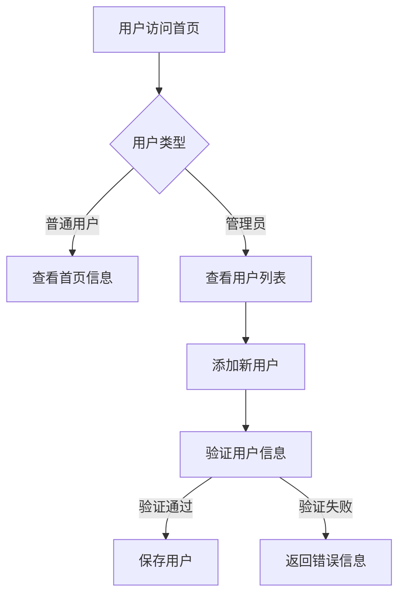

# 鲲鹏云计算综合实训项目 - 需求分析文档

## 1. 项目背景

### 1.1 项目概述

本项目是基于华为openEuler操作系统的云计算综合实训项目，旨在通过实践操作，掌握云计算基础设施搭建、容器化部署和云原生应用开发技能。项目采用"本地部署 → openEuler部署"的两阶段部署策略，最终交付一个可对外访问的Web应用系统。

### 1.2 项目目标

| 目标类型 | 目标描述 |
|----------|----------|
| **技术目标** | 掌握Docker容器化、Kubernetes编排、云原生应用开发 |
| **业务目标** | 交付一个功能完整的用户管理Web应用 |
| **学习目标** | 通过实践加深对云计算技术的理解和应用能力 |

### 1.3 项目范围

**包含范围：**
- 用户管理系统的开发与部署
- 本地Docker Compose环境搭建
- openEuler虚拟机环境搭建
- Kubernetes集群部署与管理

**排除范围：**
- 高可用架构设计（实训阶段不涉及）
- 大规模数据处理（实训阶段不涉及）
- 商业化运维体系（实训阶段不涉及）

---

## 2. 业务需求

### 2.1 业务场景

| 场景编号 | 场景名称 | 场景描述 | 涉及角色 |
|----------|----------|----------|----------|
| BS001 | 用户注册与管理 | 管理员可以查看、添加用户信息 | 管理员 |
| BS002 | 系统健康检查 | 用户可以查看系统运行状态 | 所有用户 |
| BS003 | 系统首页展示 | 用户访问系统首页获取项目信息 | 所有用户 |

### 2.2 业务流程



---

## 3. 用户需求

### 3.1 用户角色

| 角色 | 职责 | 需求优先级 |
|------|------|------------|
| **普通用户** | 访问系统首页、查看系统状态 | 高 |
| **管理员** | 管理用户信息（查看、添加） | 高 |
| **系统运维** | 部署和维护系统 | 中 |

### 3.2 用户故事

| ID | 用户角色 | 需求描述 | 验收标准 |
|----|----------|----------|----------|
| US001 | 普通用户 | 我希望访问系统首页，了解项目信息 | 首页显示项目名称和状态 |
| US002 | 管理员 | 我希望查看所有用户列表 | 显示用户ID、姓名、邮箱 |
| US003 | 管理员 | 我希望添加新用户 | 用户信息成功保存到数据库 |
| US004 | 所有用户 | 我希望查看系统健康状态 | 返回系统运行正常状态 |

---

## 4. 功能需求

### 4.1 功能模块划分

| 模块 | 功能说明 | 需求来源 |
|------|----------|----------|
| **首页模块** | 展示项目信息和欢迎页面 | US001 |
| **用户管理模块** | 用户列表展示、添加用户 | US002、US003 |
| **健康检查模块** | 系统状态监控 | US004 |

### 4.2 功能详细说明

#### 4.2.1 首页模块

| 功能点 | 描述 | 输入 | 输出 |
|--------|------|------|------|
| 首页展示 | 显示项目欢迎信息 | 无 | JSON格式的欢迎消息和状态 |

#### 4.2.2 用户管理模块

| 功能点 | 描述 | 输入 | 输出 |
|--------|------|------|------|
| 获取用户列表 | 查询所有用户信息 | 无 | 用户列表JSON数组 |
| 添加用户 | 创建新用户记录 | 用户姓名、邮箱 | 成功/失败消息 |

#### 4.2.3 健康检查模块

| 功能点 | 描述 | 输入 | 输出 |
|--------|------|------|------|
| 健康状态 | 返回系统运行状态 | 无 | 健康状态JSON |

---

## 5. 非功能需求

### 5.1 性能需求

| 需求 | 描述 | 指标 |
|------|------|------|
| 响应时间 | API接口响应时间 | ≤ 1秒 |
| 并发处理 | 支持并发用户数 | ≥ 100 |
| 数据库查询 | 单表查询时间 | ≤ 500毫秒 |

### 5.2 可用性需求

| 需求 | 描述 | 指标 |
|------|------|------|
| 系统可用性 | 系统正常运行时间 | ≥ 99%（实训环境） |
| 故障恢复 | 服务重启时间 | ≤ 5分钟 |

### 5.3 安全性需求

| 需求 | 描述 |
|------|------|
| 数据存储 | 数据库密码加密存储 |
| 网络安全 | 禁止明文传输敏感数据 |
| 访问控制 | 限制未授权访问 |

### 5.4 兼容性需求

| 需求 | 描述 |
|------|------|
| 浏览器兼容 | 支持主流浏览器（Chrome、Firefox、Edge） |
| 平台兼容 | 支持Linux（openEuler）环境部署 |

---

## 6. 数据需求

### 6.1 数据实体

#### 6.1.1 用户实体

| 字段名 | 类型 | 约束 | 说明 |
|--------|------|------|------|
| id | INT | PRIMARY KEY, AUTO_INCREMENT | 用户唯一标识 |
| name | VARCHAR(100) | NOT NULL | 用户姓名 |
| email | VARCHAR(100) | NOT NULL, UNIQUE | 用户邮箱 |
| created_at | TIMESTAMP | DEFAULT CURRENT_TIMESTAMP | 创建时间 |

### 6.2 数据流程图


---

## 7. 接口需求

### 7.1 API接口清单

| API路径 | HTTP方法 | 所属模块 | 功能描述 |
|---------|----------|----------|----------|
| `/` | GET | 首页模块 | 获取欢迎信息 |
| `/api/users` | GET | 用户管理 | 获取用户列表 |
| `/api/users` | POST | 用户管理 | 添加新用户 |
| `/api/health` | GET | 健康检查 | 获取系统状态 |

### 7.2 接口详细说明

#### 7.2.1 GET /

**描述：** 获取系统首页欢迎信息

**请求：**
```
GET /
```

**成功响应（200 OK）：**
```json
{
  "message": "欢迎来到鲲鹏云计算实训项目",
  "status": "success"
}
```

#### 7.2.2 GET /api/users

**描述：** 获取用户列表

**请求：**
```
GET /api/users
```

**成功响应（200 OK）：**
```json
[
  {
    "id": 1,
    "name": "张三",
    "email": "zhangsan@example.com",
    "created_at": "2024-01-01 10:00:00"
  },
  {
    "id": 2,
    "name": "李四",
    "email": "lisi@example.com",
    "created_at": "2024-01-02 11:00:00"
  }
]
```

#### 7.2.3 POST /api/users

**描述：** 添加新用户

**请求：**
```
POST /api/users
Content-Type: application/json

{
  "name": "王五",
  "email": "wangwu@example.com"
}
```

**成功响应（201 Created）：**
```json
{
  "message": "User added successfully"
}
```

**失败响应（400 Bad Request）：**
```json
{
  "error": "Email already exists"
}
```

#### 7.2.4 GET /api/health

**描述：** 获取系统健康状态

**请求：**
```
GET /api/health
```

**成功响应（200 OK）：**
```json
{
  "status": "healthy"
}
```

---

## 8. 部署需求

### 8.1 本地部署需求

| 资源 | 要求 |
|------|------|
| 操作系统 | Windows 10/11、macOS 10.15+、Linux |
| Docker Desktop | 4.0+ |
| Docker Compose | 2.23.0+ |
| 内存 | 8GB+ |
| 磁盘 | 20GB+ |

### 8.2 openEuler部署需求

| 资源 | 要求 |
|------|------|
| 虚拟机软件 | VirtualBox 7.0+ 或 VMware |
| 操作系统 | openEuler 22.03 LTS SP3 |
| CPU | 4核 |
| 内存 | 8GB |
| 磁盘 | 50GB |

---

## 9. 约束条件

### 9.1 技术约束

| 约束 | 说明 |
|------|------|
| 编程语言 | Python 3.11 |
| 框架 | Flask 3.0.0 |
| 数据库 | MySQL 8.0.35 |
| 容器 | Docker 24.0.6 |
| 编排 | Kubernetes 1.28.2 |

### 9.2 时间约束

| 阶段 | 时间 |
|------|------|
| 本地部署 | 1周 |
| openEuler部署 | 1周 |
| 总计 | 2周 |

### 9.3 资源约束

| 资源 | 约束 |
|------|------|
| 团队人数 | 4人 |
| 虚拟机数量 | 1台（openEuler） |
| 预算 | 无（使用开源软件和本地资源） |

---

## 10. 验收标准

### 10.1 功能验收

| 验收项 | 验收标准 |
|--------|----------|
| 首页访问 | http://localhost:5000 返回欢迎信息 |
| 用户列表 | GET /api/users 返回用户数组 |
| 添加用户 | POST /api/users 成功创建用户 |
| 健康检查 | GET /api/health 返回healthy状态 |

### 10.2 部署验收

| 验收项 | 验收标准 |
|--------|----------|
| 本地部署 | Docker Compose启动成功，所有服务运行正常 |
| openEuler部署 | Kubernetes集群就绪，应用可访问 |
| 对外访问 | 通过网址可访问所有功能 |

---

## 附录

### A. 术语定义

| 术语 | 定义 |
|------|------|
| 云原生 | 基于云计算架构设计的应用开发方式 |
| 容器化 | 将应用及其依赖打包成容器的过程 |
| Kubernetes | 容器编排平台，用于自动化部署、扩展和管理容器化应用 |
| openEuler | 华为开源的Linux操作系统发行版 |

### B. 参考文档

1. Flask官方文档：https://flask.palletsprojects.com
2. Kubernetes官方文档：https://kubernetes.io/docs
3. Docker官方文档：https://docs.docker.com
4. openEuler官方文档：https://docs.openeuler.org